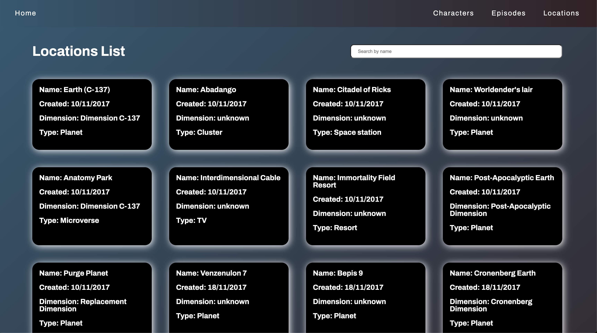

# RickAndMorty

This project was generated with [Angular CLI](https://github.com/angular/angular-cli) version 13.3.3.

## Screenshots

This are some images from the project:

### Home Page

### Characters Page

### Episode Page

### Location Page

## Description

I created a home page that contains the main three records for characters, episodes, and locations.

In this project you would see:

1. The use of the routing module to handle all the components and the data.

2. The creation of one service to fetch the data for every scenario: characters, locations and episodes.

3. The integration of multiple components thinking about the user experience.

4. The integration of a search bar for each list with the name as a criteria for the search.

## Considerations

### Please keep in mind I had just two days to complete this exercise and the other exercises from the interview
